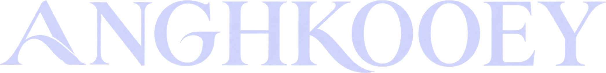
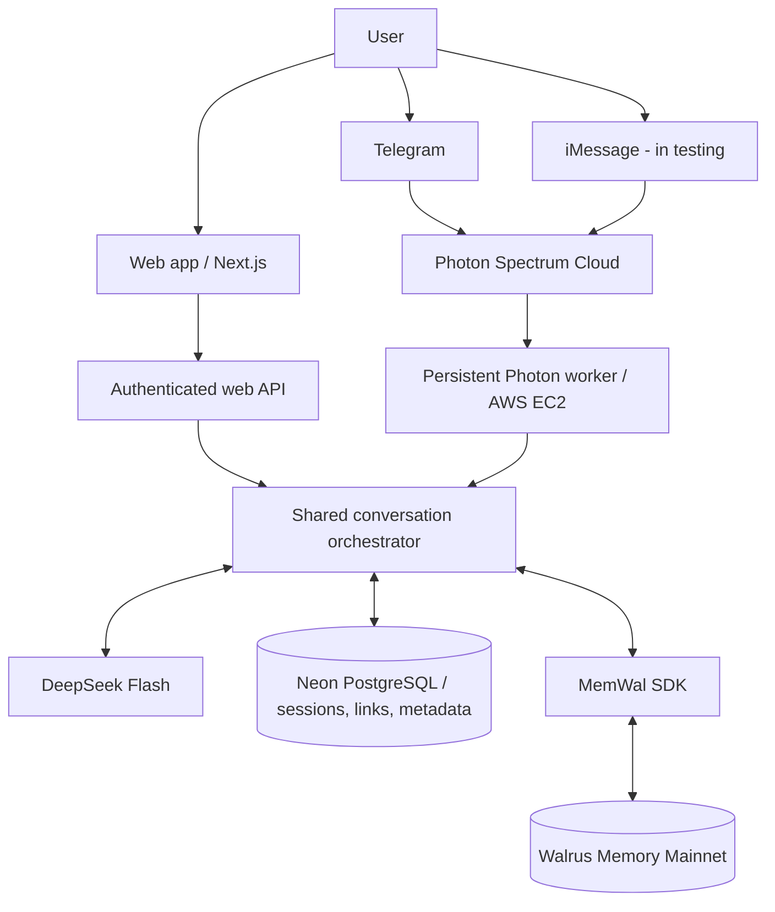

<div align="center">

<a href="https://anghkooey.vercel.app" aria-label="Visit Anghkooey">
  
</a>

<br />



### You shouldn't have to explain yourself twice.

**A personal AI concierge that remembers how you like things.**  
Anghkooey brings relevant preferences, constraints, and past experiences back into your next conversation — starting with hotels, travel, and dining.

<p>
  <a href="https://anghkooey.vercel.app"></a>
  <a href="https://anghkooey.vercel.app/chat"></a>
  <a href="https://t.me/useanghkooey_bot"></a>
</p>

<p>
  <a href="./LICENSE"></a>
  <a href="https://www.walrus.xyz/"></a>
  <a href="https://api-docs.deepseek.com/"></a>
  <a href="https://github.com/Devendurance/anghkooey"></a>
</p>

[**Explore the experience**](#the-experience) · [**How memory works**](#how-memory-works) · [**Run locally**](#run-it-locally) · [**Architecture**](#architecture) · [**Documentation**](#project-documentation)

</div>

---

## Why Anghkooey?

Most assistants can answer a question. Fewer can carry forward the *reason behind your preferences*.

A quiet hotel room matters differently when you've said road noise kept you awake on your last trip. Anghkooey is designed to remember that context — **when you consent to saving it** — and use it when it becomes relevant again.

**The idea is simple:** remember the preference, preserve the reason, and let the person correct it when life changes.

## The experience

| Experience | What you can do |
| :--- | :--- |
| **Web chat** | Start a real DeepSeek conversation in the browser, without email signup or a wallet. |
| **Memory, by choice** | Opt in before Anghkooey saves lasting preferences to Walrus Mainnet. Chat remains usable with memory saving off. |
| **Personalized recall** | Receive answers informed by relevant, previously saved Walrus memories, with recall receipts when available. |
| **Memory library** | Browse confirmed memory metadata, filter by category/status, and search for matching stored facts. |
| **Corrections** | Replace an outdated preference with a new confirmed Walrus memory; the old record is retired from recall, not deleted from Mainnet. |
| **Linked conversations** | Connect a browser identity with Telegram or an iMessage chat using a single-use code and verified in-channel approval when accounts need consolidating. |
| **Privacy controls** | Change memory consent and end a browser session, with clear information about what each action does *not* erase. |

**Channel availability:** web chat and the [Telegram bot](https://t.me/useanghkooey_bot) are the public entry points. iMessage is integrated through Photon but remains **in testing**; no public contact is advertised here.

### Product gallery

> **Visual placeholders:** Add your actual screenshots to `docs/media/` before publishing a demo-focused README. These slots are deliberately labelled rather than displaying invented product screenshots or broken image links.

<p align="center"><strong>01 — The cinematic opening</strong></p>
<p align="center"><em>📷 Add <code>docs/media/landing-hero.png</code> — folded-A reveal / orbital hero</em></p>

<!-- Replace the placeholder above after adding your real screenshot:
<p align="center"></p>
-->

<p align="center"><strong>02 — A conversation that remembers</strong></p>
<p align="center"><em>📷 Add <code>docs/media/web-chat.png</code> — web chat with a real memory-recall receipt</em></p>

<!-- Replace the placeholder above after adding your real screenshot:
<p align="center"></p>
-->

<p align="center"><strong>03 — Memories, corrections, and connections</strong></p>
<p align="center"><em>📷 Add <code>docs/media/memories-and-profile.png</code> — memory archive and channel linking</em></p>

<!-- Replace the placeholder above after adding your real screenshot:
<p align="center"></p>
-->

**Demo video:** _[Add your public demo link here after publication]._  
**Mainnet evidence:** _[Add a sanitized proof/evidence link here when available; do not expose user content]._ 

## How memory works

1. **Tell Anghkooey what matters.** Share a hotel, travel, or dining preference and, ideally, why it matters.
2. **Choose whether to remember it.** Saving new long-term memories requires explicit consent.
3. **Confirm the save.** The server extracts meaningful facts and waits for an actual Walrus Mainnet write; a success label is shown only after confirmation.
4. **Return and ask again.** Anghkooey searches the correct user namespace for relevant memories and supplies that context to DeepSeek Flash.
5. **Correct it later.** Corrections append a new memory and mark the older record as superseded for future recall.

For example:

> **You:** “I avoid rooms facing busy roads because traffic noise keeps me awake.”  
> **Later:** “What should I prioritize when choosing a hotel?”  
> **Anghkooey:** Can use the *confirmed* preference and its reason to advise prioritizing quieter rooms, without pretending to know live availability.

*This exchange is illustrative; it is not a quoted or fabricated production chat transcript.*

### One person, three conversations

Web, Telegram, and iMessage use the same conversation engine. Linking is **not automatic**: a web session generates a one-time, 10-minute code, which the user sends to Anghkooey inside the target messaging channel. Photon verifies the actual sender. If that channel already has a separate memory account, the person explicitly approves consolidation with `MERGE YES` (or declines with `MERGE NO`). Existing memories remain in their original Walrus namespaces and are recalled through authorized identity aliases.

**Important:** an anonymous browser session is not a recoverable email login. Clearing cookies, ending the session, or switching devices can prevent access to that specific web identity. Wallet connection is not required and does not confer individual custody over memories in the current architecture.

## Architecture



**Where things live:**

- **Vercel:** Next.js app, chat UI, memory/profile/settings pages, and server-side API routes.
- **AWS EC2:** exactly one supervised, continuously running Photon worker for messaging.
- **Neon PostgreSQL:** user/session identities, consent, channel links, idempotency, temporary conversation history, and Walrus blob metadata.
- **Walrus Mainnet:** durable memory facts stored through `@mysten-incubation/memwal`. Neon is **not** a replacement long-term preference store.
- **DeepSeek Flash:** the deployed conversation model, independent of any coding assistant used to build the project.

### Technology

| Layer | Technology |
| :--- | :--- |
| App | Next.js 16, React 19, TypeScript |
| Styling and motion | Tailwind CSS 4, GSAP / ScrollTrigger, Cormorant Garamond, Satoshi, Georama |
| AI | DeepSeek Flash |
| Durable memory | Walrus Mainnet via MemWal SDK |
| Database | Neon PostgreSQL |
| Messaging | Photon Spectrum (`spectrum-ts`) for Telegram and iMessage |
| Hosting | Vercel (web) and AWS EC2 + systemd (worker) |

## Run it locally

### Prerequisites

- **Node.js 24.x** recommended (the production web deployment uses Node 24).
- npm, Git, a Neon Postgres database, DeepSeek API access, and Walrus Memory Mainnet credentials.
- Photon project credentials and a Telegram bot token **only if running the messaging worker**.

### 1. Clone and install

```bash
git clone https://github.com/Devendurance/anghkooey.git
cd anghkooey
npm ci --legacy-peer-deps --include=dev
```

The peer-dependency flag reflects the repository's current dependency resolution. Don't run `npm audit fix --force` as a substitute.

### 2. Configure server secrets

```bash
# Copy the template only if .env does not already exist.
test -e .env || cp .env.example .env
```

Edit `.env` locally. Never commit it, paste credentials into issues, or expose keys through `NEXT_PUBLIC_*` variables.

| Setting | Purpose |
| :--- | :--- |
| `DEEPSEEK_API_KEY` | DeepSeek API credential |
| `DEEPSEEK_BASE_URL` | DeepSeek API base URL (template includes a default) |
| `DEEPSEEK_MODEL` | `deepseek-flash` |
| `DEEPSEEK_THINKING` | Optional; defaults to `disabled` for normal chat and extraction |
| `DATABASE_URL` | Neon PostgreSQL connection string |
| `APP_SESSION_SECRET` | Secret used to protect opaque session tokens; use a strong random value |
| `WEB_BASE_URL` | Local URL in development; public HTTPS origin in production |
| `MEMWAL_PRIVATE_KEY` | Server-only MemWal private credential |
| `MEMWAL_ACCOUNT_ID` | Application-managed MemWal account identifier |
| `MEMWAL_SERVER_URL` | Mainnet relayer URL (template includes a default) |
| `PHOTON_PROJECT_ID` | Photon project identifier, for the worker |
| `PHOTON_PROJECT_SECRET` | Photon server credential, for the worker |
| `TELEGRAM_BOT_TOKEN` | Telegram bot credential, for the worker |

The repository's [`.env.example`](./.env.example) is the canonical variable-name reference.

### 3. Prepare the database and run the web app

```bash
# Apply the existing migrations to your intended database only.
npm run migrate

npm run dev
```

Open [http://localhost:3000](http://localhost:3000). The web chat is at `/chat`; the memory archive is at `/memories`.

**Do not run migrations against a live database casually.** The deployed project uses an existing migrated Neon database. Use a separate development database when experimenting.

### 4. Optional: run the messaging worker

```bash
npm run photon:readiness
npm run worker:start
```

**Only one Photon worker instance should listen to a given project at a time.** If the AWS production worker is running, **do not** start a second local worker with the same Photon credentials; competing workers can duplicate deliveries and replies. See the [Photon deployment guide](./docs/DEPLOY-PHOTON.md).

### 5. Checks

```bash
npm test
npm run typecheck
npm run lint
npm run build
npm run check:integrations
```

Some integration tests require database access. `photon:readiness` is the dedicated Photon check; the generic integration checker may contain legacy Photon status wording. Scripts such as `smoke:memory` and `test-channel-flow` can perform **real, chargeable Mainnet writes** — run them deliberately, not as routine build checks.

## Project structure

```text
src/app/                  Next.js pages and HTTP routes
src/components/           Landing, brand, and app experiences
src/server/               Sessions, identity, DeepSeek, Walrus, orchestration
src/lib/                  Shared site configuration and client helpers
workers/photon-worker.ts  Long-running Telegram/iMessage consumer
db/migrations/            PostgreSQL schema and migration history
scripts/                  Readiness, verification, and migration utilities
tests/                    Automated regression and integration tests
docs/                     PRD, TRD, architecture, deployment guides
public/brand/anghkooey/   Branding and production artwork
```

## Trust, security, and current limits

- **Opt-in durable memory.** Memory writes are gated by consent; existing memories may still be recalled when new saving is disabled.
- **Scoped retrieval.** Sessions and verified channel identities determine which Walrus namespaces may be searched.
- **Verified linking.** One-time codes are hashed in the database; Telegram/iMessage identity comes from authenticated Photon events, not a user-entered display name.
- **Transparent provenance.** Chat can show a recalled memory receipt or a confirmed new blob ID. Semantic search returns **matches**, not an exhaustive plain-text inventory.
- **Corrections, not erasure.** Replacing a memory retires its old metadata from recall; it does not promise immediate destruction of an already published Walrus blob.
- **Managed custody.** The current MemWal account and relayer-managed encryption are application-side infrastructure, **not individual wallet custody** or user-held encryption keys.
- **No verified live bookings.** Anghkooey does not claim hotel inventory, current prices, reservations, or integrations it cannot verify.
- **No cross-device web recovery yet.** Guest browser sessions are convenient but should not be mistaken for a full account-recovery system.
- **iMessage is in testing.** Public contact details will appear only when a supported public channel is available.

Do not publish other users' memory contents, private IDs, or unredacted receipts in demos or issues without their permission.

## Deployment

The production architecture uses separate hosts for web and messaging:

- **Web:** [Vercel deployment guide](./docs/DEPLOY-WEB.md). Set server-only environment variables, use `WEB_BASE_URL` with your public HTTPS domain, and verify `/api/health` plus actual chat behavior. Disable deployment protection for the public production domain before inviting users or judges.
- **Worker:** [Photon deployment guide](./docs/DEPLOY-PHOTON.md). Use a persistent systemd or container process; verify readiness and real message replies. Keep exactly one active consumer.

The web app being *built successfully* does not by itself prove the messaging worker is running. Conversely, worker readiness is not a substitute for a live Telegram/iMessage test.

## Project documentation

| Document | What it covers |
| :--- | :--- |
| [Product requirements](./docs/PRD.md) | User journeys, intended experience, acceptance criteria |
| [Technical requirements](./docs/TRD.md) | Architecture contracts, security, memory semantics |
| [System architecture](./docs/architecture.md) | Data flows and trust boundaries |
| [Brand messaging](./docs/anghkooey%20brand%20messaging.md) | Positioning, UX language, responsible claims |
| [Design system](./DESIGN.md) | Typography, palette, motion, visual patterns |
| [Web deployment](./docs/DEPLOY-WEB.md) | Vercel and API configuration |
| [Photon deployment](./docs/DEPLOY-PHOTON.md) | Worker hosting and secure channel linking |
| [Backend status](./BACKEND-STATUS.md) | Implementation notes and verified backend milestones |

## License and assets

The **original software source code** in this repository is made available under the [MIT License](./LICENSE) — see the license text for terms and warranty disclaimer.

**Brand marks, the Anghkooey name, original artwork, ribbon imagery, screenshot/video material, and bundled fonts are not granted a separate reuse license merely by the software's MIT license.** Their use or redistribution depends on ownership and the terms of their respective rights holders. Third-party libraries retain their own licenses. If you fork the code, use your own branding unless you have permission to use these assets.

<div align="center">

---

**Anghkooey** · Remember the preference. Preserve the reason.  
Built by [Devendurance](https://github.com/Devendurance) · © 2026

[Back to top](#)

</div>
