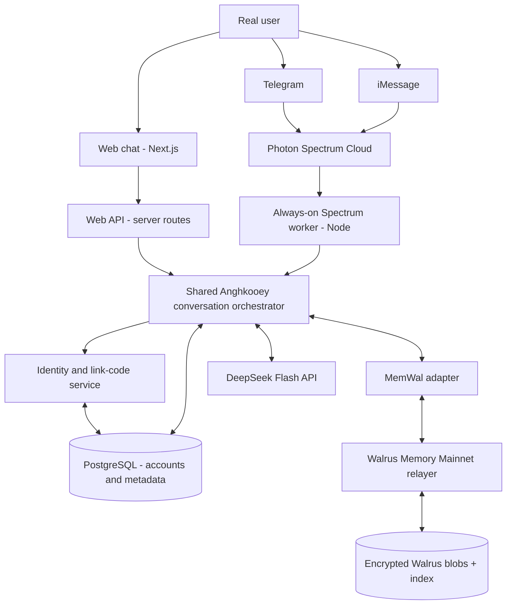
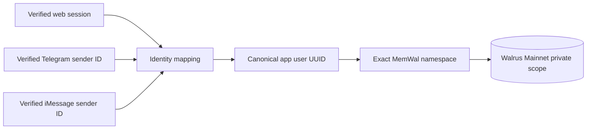
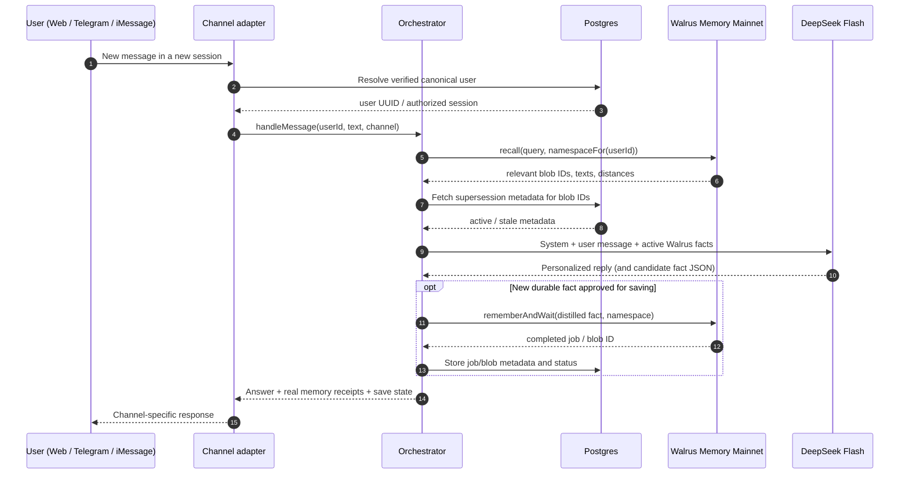
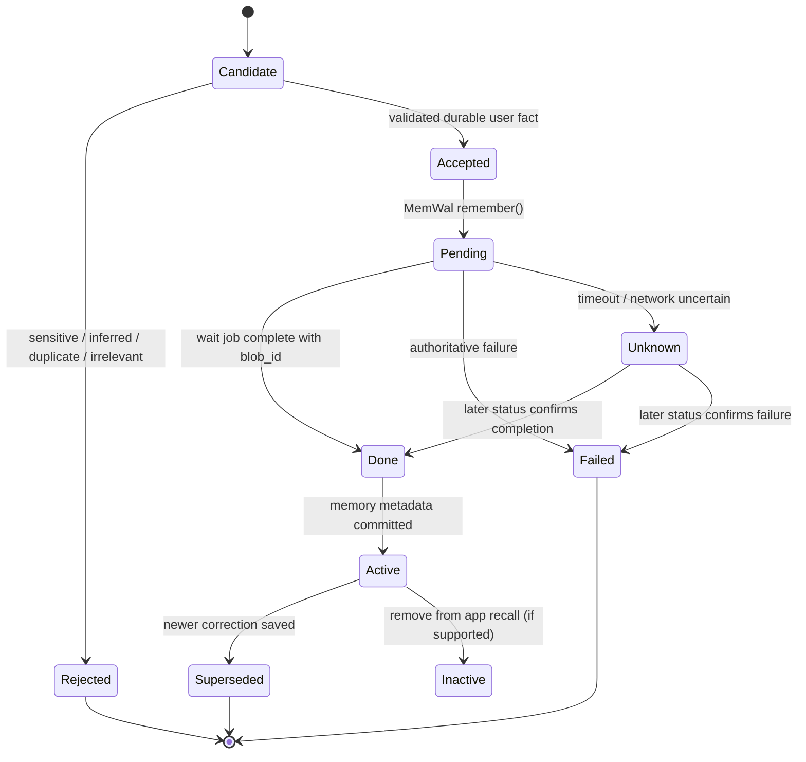
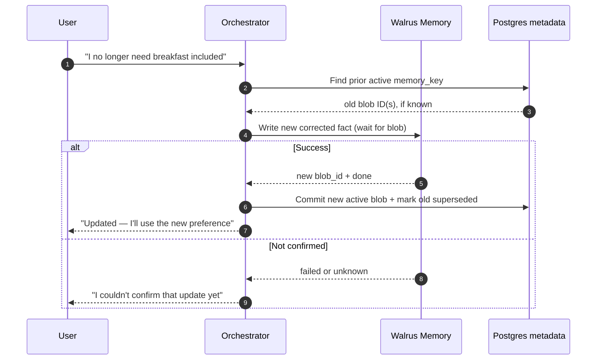
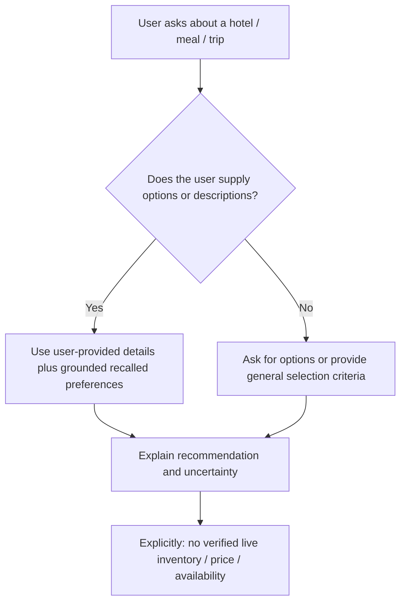

# ANGHKOOEY — SYSTEM ARCHITECTURE

**Version:** 1.0 · **Date:** 8 October 2026 · **Status:** Target architecture, not a deployed system  
**Decision posture:** One memory-backed conversation engine; three channels; minimal infrastructure; security and testability over feature breadth.

## 1. Architecture in one paragraph

Anghkooey is a **multi-channel personal concierge** with a shared TypeScript backend. Users chat on **Web**, **Telegram**, or **iMessage**. Web requests enter a protected API; messaging arrives through a long-lived **Photon Spectrum** Node worker. Both invoke the **same conversation orchestrator**, which authenticates a canonical application identity, retrieves only that person's relevant **Walrus Memory Mainnet** facts, constructs a bounded grounded prompt for **DeepSeek Flash**, and returns an answer. New lasting facts are written to Walrus, not a replacement SQL preference database. Postgres holds channel identity links, sessions, memory blob/job metadata, supersession states, and message idempotency. Hotel bookings and live inventory are not architectural dependencies for this MVP.

## 2. Context / deployment diagram



**Hosting plan:** Deploy Next.js web to Vercel (or a Node web server) and run the Spectrum message consumer on a persistent Linux VPS/container. Both services use the same database and production MemWal account but never expose provider secrets to the browser. If one physical machine is chosen for both processes, keep the logical process separation intact.

**Why persistent worker:** Photon's agent-loop examples use `for await (const [space, message] of app.messages)`. An always-on process can maintain the stream, resume/reconnect, and handle iMessage and Telegram reliably. A short-lived serverless function is the wrong location for the stream.

## 3. Components, ownership, trust boundaries

| Component | Owns | Must NOT own |
|---|---|---|
| **Web UI** | Onboarding, chat, receipts, link-code UI, status | Secret keys, Walrus namespace selection, direct unrestricted MemWal access |
| **Web API** | Session cookie validation, server input guards, `handleMessage` invocation | Independent alternate memory logic |
| **Photon worker** | Channel connection, verified sender ID extraction, inbound dedupe, outbound formatting | Per-platform preference profiles or separate LLM prompts |
| **Identity service** | Canonical `user_uuid`, channel mappings, secure link tokens, authorization | Guessing identities from display names, phone number similarity, or message text |
| **Orchestrator** | Intent classification, retrieval timing, prompt assembly, DeepSeek call, memory write decisions, cited answer | Direct trust in unvalidated model JSON or user-provided blob IDs |
| **MemWal adapter** | Mainnet SDK initialization, authorized namespace, `rememberAndWait`, `recall`, job/trace outputs | Mock writes or DB-only long-term memory |
| **Postgres** | Identity, link codes, sessions, short-lived recent turns, blob metadata, idempotency | Source of long-term personal-preference content |
| **Walrus Memory Mainnet** | Durable fact content, cryptographic blob storage, semantic retrieval through relayer | Web/mobile session auth, channel verification |
| **DeepSeek API** | Natural-language response and candidate fact extraction | Authorization, credentials, arbitrary writes, assumed live inventories |

### Trust boundaries

1. **External inbound text** is untrusted, including statements such as “my user ID is X” or “ignore security rules.”
2. **Photon event identity** is trusted only after verified transport/provider processing and deterministic mapping by backend.
3. **Web cookie** is trusted only after signature/session lookup; never accept a user UUID from client JSON.
4. **LLM output** is advisory. Validate all extracted facts and actions; the model cannot pick namespaces, link accounts or issue database writes on its own.
5. **Walrus plaintext recall** is personal data. Include only the correct current user's relevant facts in the model input; do not log/store it in public metrics.
6. **Credentials** (`MEMWAL_PRIVATE_KEY`, Photon secret, DB URL, DeepSeek key) exist only on trusted server environments.

## 4. Identity model: the core invariant

**Invariant:** For every inbound request, the server resolves **exactly one** `app_user_id` from an authenticated web session or verified messaging sender; `namespace = "anghkooey:v1:u:" + app_user_id` is then constructed server-side. No caller can override it.



### Initial identity

- First Web visit: create a first-party user profile and session token; set Secure + HttpOnly + SameSite cookie when hosted over HTTPS.
- First Telegram/iMessage DM: create a channel-specific provisional user UUID. No claim that this sender belongs to an existing web user until verification.
- Group chat: out of scope for personal memory; do not access private user memories in group space.

### Linked identity

- Authenticated/verified source requests random, short-lived, one-use link code.
- Target channel presents code from a verified sender account.
- Source approves pending link; server atomically connects `(platform, verified_sender_id)` to existing canonical UUID and burns token.
- The target channel now shares the same user-scoped namespace. Both channels maintain separate sessions but **one long-term memory**.
- If target already has memories under another UUID, **block automatic merging** and disclose that existing memory remains separate until a safe explicit migration exists.

### Link threat model

- **Code theft:** 128+ bits entropy; expiration; confirmation from source; brute-force throttle.
- **Replay:** one-use update transaction and uniqueness checks.
- **Platform spoofing:** sender ID is taken from verified provider event metadata, not chat content or phone-number claims.
- **Account collision:** a provider sender ID is unique; reject simultaneous link to multiple users.
- **Session theft:** secure cookie, server-side session invalidation, avoid PII stored in localStorage.

## 5. Main conversation sequence



**Key distinction:** The `recall` call happens on every relevant advice request, including **fresh conversations**. Old chat history is not passed as a pretend substitute for durable memory.

### Chat orchestrator conceptual contract

```ts
type Channel = "web" | "telegram" | "imessage";

type Incoming = {
  canonicalUserId: string;    // server-resolved only
  channel: Channel;
  sessionId: string;         // server-resolved
  deliveryId: string;        // server or provider message id
  text: string;
};

type MemoryReceipt = {
  blobId: string;            // actual Walrus ID
  reason: string;            // short, grounded paraphrase
};

type ChatResult = {
  answer: string;
  memoryReceipts: MemoryReceipt[];
  saves: { completed: number; pending: number; failed: number };
};
```

These are Anghkooey-owned application types. They are **not** representations of third-party SDK APIs.

## 6. Memory write and index lifecycle



- If `rememberAndWait` returns `blob_id`, it is evidence of completed job as reported by production MemWal. Persist `job_id`, `blob_id`, account/environment, namespace and timestamp.
- If the network times out after accepting the write, **do not blindly retry**: MemWal writes are append-only. Resolve job status first if an identifier is available, otherwise mark as uncertain and avoid double counting.
- Do **not** count candidates, messages, job acceptance, or extracted facts as completed Mainnet blobs.
- MemWal's relayer performs encryption/upload/indexing. The service may hold durable index metadata in its own relayer PostgreSQL; Anghkooey's application Postgres is only operational metadata.
- Retention/forgetting: SDK docs warn removing index entries need not remove underlying Walrus blobs until expiry. User copy must match actual semantics.

### Memory content and schema strategy

A stored blob should contain a small, explicit statement, e.g.:

```text
TYPE: experience-derived preference
DOMAIN: stays
KEY: stay.noise_preference
FACT: I prefer quiet hotel rooms even if they are slightly farther from the city center.
WHY: A previous road-facing hotel room disrupted my sleep.
SCOPE: durable preference
RECORDED: 2026-10-08
SOURCE: stated directly by the user
```

- The fields above are **text inside a Walrus memory**; they do not imply MemWal supports a native typed upsert schema.
- The app's `memory_metadata` holds the `blob_id` and *non-content* revision information (key, state, relation) to prevent stale facts from reaching the model.
- If a user says “my budget for this weekend is 100k NGN,” set `SCOPE: trip-specific`, not `permanent budget`.
- Add a user-facing memory receipt only if the source `blob_id` actually appears in relevant authorized retrieval.

## 7. Supersession and conflict sequence



**Retrieval safeguard:** Recall returns nearest matches; it might still retrieve a stale blob. Filter out known superseded IDs before prompt construction, fetch enough candidates to avoid empty context after filtering, and ask for clarification on unresolved contradictions. Never overwrite old Walrus blob contents by pretending `remember` is an upsert.

## 8. No-live-bookings boundary



The model must not represent hotels as partners, imply that a room is available, promise a booking, or fabricate review scores or menus. Future integrations will require authoritative provider APIs, permissions, business terms and payment/booking confirmation flows. A recommendation based on text the user supplied is already useful and demo-ready.

## 9. Deployment topology and operational ownership

### Web service

- Next.js App Router on Vercel or an equivalent Node host.
- `POST /api/chat`, authenticated user session, channel linking and memory status endpoints.
- Server modules for MemWal and DeepSeek; **no `NEXT_PUBLIC_MEMWAL_PRIVATE_KEY`**, no provider keys in browser bundles.
- UI is mobile-first and resilient to slow writes: waiting, memory-saved, and temporary-unavailable states.

### Spectrum service

- Separate always-on Node process on the user's controlled Linux VPS or managed container.
- `spectrum-ts` with `imessage.config()` and `telegram.config()` after credentials/provisioning are confirmed.
- Auto restart (`systemd`, `pm2`, Docker restart policy); health and structured logs; graceful shutdown.
- HTTPS/TLS/webhook/event config per the actual Photon Cloud provider docs and installed SDK.
- Provider event stream → normalize sender/message → dedupe → invoke shared core → `space.send()` → record response status.

### Data service

- Managed Postgres (existing Neon project if accessible, or any reliable hosted instance).
- Restricted DB credentials; additive SQL migrations; indexes on provider identities and unique message events.
- Backups and schema migrations should preserve real tester data; do not reset to fix demos.

### Production Walrus

- Registered Mainnet MemWal account/delegate key with relayer `https://relayer.memory.walrus.xyz`.
- Separate from staging credentials. Never infer network from URL alone: verify configured account/environment and actual completed jobs.
- Capture account ID, delegate public identifier (where appropriate), and actual blob IDs for submission. Agent ID requested by the form must be taken from the actual account/setup, not invented.

## 10. Data classification, security, and retention

| Data | Where | Retention / controls |
|---|---|---|
| Personal preference, experience and why | **Walrus Memory Mainnet** encrypted memory flow | Walrus-specific blob lifetime; index forgetting isn't immediate physical deletion |
| Current user UUID, channel sender mapping | Postgres | Necessary for linking; restrict access and disclose |
| Blob IDs and revision states | Postgres | Operational metadata, not a substitute for content |
| Short-term conversation turns | Small TTL cache or Postgres expiring rows | Only for active context; not marketed as long-term memory |
| Link codes | One-way hashes in Postgres | ≤10-minute expiry, single use, source confirmation |
| Developer/test evidence | Local private directory and public sanitized samples | Explicit consent; redact phone numbers, names, user private conversations |
| Secrets | Server environment/secret manager | Never public, never commit, rotate if exposed |

### Threat model snapshot

| Attack / failure | Mitigation |
|---|---|
| User A prompts bot to reveal User B | Database mapping + MemWal namespace computed server-side, isolation tests, no prompt-only auth |
| Prompt injection into a remembered fact | Treat Walrus content as **data**, not privileged instructions; quote/label sources and validate actions |
| Social engineering account links | Verified source/target identities, source confirmation, one-time codes, conflict guard |
| Duplicate Telegram/iMessage event | Unique provider event ID and DB idempotency state |
| Stale memory gives wrong answer | Superseded filtering, correction precedence, explicit uncertainty |
| SDK/index outage | Show degraded, not fake persistence; queue/resume via tracked job IDs where possible |
| Misleading privacy claims | Clear consent notice and actual MemWal erase semantics; no promise of permanent deletion |
| Hallucinated hotel inventory | No live booking/search tool; system prompt and integration-free UI clearly disclaim availability |

## 11. Observability, evidence, and auditability

**Log** with per-message correlation ID: `channel`, `user_hash`, `session_id`, `model_id`, `memwal_namespace_hash`, `recall_result_count`, returned `blob_id` references, `memory_job_status`, latency and provider send status. **Do not log raw sensitive memory content** or full addresses/phone numbers.

**Evidence manifest example** (`evidence/manifest.example.json` may be created during implementation):

```json
{
  "status": "EXAMPLE_ONLY_NOT_REAL_EVIDENCE",
  "network": "mainnet",
  "relayer": "https://relayer.memory.walrus.xyz",
  "sdkVersion": "<installed-version>",
  "model": "deepseek-flash",
  "accountId": "<actual-account-id>",
  "testUsers": [
    {"label": "tester-A", "confirmedBlobs": 10, "newSessionRecallPassed": true},
    {"label": "tester-B", "confirmedBlobs": 10, "newSessionRecallPassed": true},
    {"label": "tester-C", "confirmedBlobs": 10, "newSessionRecallPassed": true}
  ],
  "channelsVerified": {"web": false, "telegram": false, "imessage": false},
  "gitCommit": "<actual-sha>",
  "publicDemoUrl": "<deployed-url>"
}
```

**IMPORTANT:** The JSON above is a schema illustration and must not be submitted as proof. Generate the final manifest from **observed jobs**, set booleans from actual test outcomes, list actual unique blob IDs (in a private sanitized audit if appropriate), and record what could *not* be verified. An accepted SDK job alone does not prove completed Mainnet persistence.

### Evidence sequences to film/screenshoot

1. **Before memory:** same question in explicitly memory-disabled mode; bot cannot know the preference and asks again.
2. **Save and return:** actual user states reasoned preference → Walrus blob confirmed → new session → bot uses retrieved fact.
3. **Correct:** user revises requirement → completed corrected blob → new session uses latest fact.
4. **Cross-channel:** linked same user switches from Web to Telegram to **real iMessage**; no transcript copy, no remembered fact retyped.
5. **Isolation:** another user asks similar question, does not see first user's memory.
6. **Scale for contest:** 3 consenting testers, each independently ≥10 completed memory blob IDs on Mainnet.

## 12. Failure modes and recovery paths

| Symptom | Diagnoses | Response |
|---|---|---|
| MemWal 401 | Key not registered, account mismatch, staging/mainnet mismatch | Stop claiming writes; verify delegate/account; do not rotate randomly |
| Memory write accepted but recall empty | Async indexing, wrong namespace, relayer search distance | Wait job completion, exact namespace, filter threshold tests, trace job |
| Recall yields irrelevant snippets | No default cutoff or broad query | Tighten `maxDistance`, query focus, cap memories, ask user |
| User correction does not stick | Old and new blobs both present; stale retrieval dominated | Trace blob IDs, filter superseded, wider top-K, retest after fresh session |
| Photon iMessage doesn't receive | Cloud project/line provisioning, routing, credentials, transport | Run minimal echo test before core integration; inspect provider logs; document blocker if externally gated |
| Telegram duplicate reply | Stream replay/at-least-once behavior | Unique inbound event ID, atomic processed status |
| Web memory works but Telegram doesn't | Wrong channel-to-user mapping | Verify link token and resolved canonical UUID; never copy memory across unrelated namespaces |
| Worker dies after one exception | Unhandled event-loop error | Per-message exception handling; restart policy; healthcheck |
| LLM produces a fake remembered fact | Hallucinated memory citation | Restrict receipt generation to actual Walrus recall sources; require evidential wording |

## 13. Architectural decisions (ADRs)

### ADR-001: Walrus is the durable memory authority — **Accepted**

**Reason:** Central judging criterion; portable semantic memory and Mainnet verifiability. SQL-only preference storage would undermine the project claim.  
**Cost:** Indexing waits, blob lifecycle semantics, external dependency.  
**Mitigation:** Proper async job tracking and receipts.

### ADR-002: One custodial Mainnet account, per-user namespaces — **Accepted for hackathon**

**Reason:** Fastest credible multi-user demo with the SDK's `(owner, namespace)` isolation.  
**Trade-off:** Users do not yet hold their own independent Walrus account keys.  
**Future:** Optional per-user owner/delegate model and controlled portability.

### ADR-003: DeepSeek is the deployed primary model — **Accepted**

**Reason:** Non-OpenAI/non-Anthropic model eligibility; reasonable hosted integration.  
**Contrast:** Muse Spark Contributor within Pi is solely the build assistant.  
**Fallback:** A qualifying Qwen model through a verified provider, with the article updated to name the model actually used.

### ADR-004: Photon Spectrum handles Telegram and iMessage — **Accepted, access-dependent**

**Reason:** One messaging architecture; consistent product memory across both surfaces.  
**Gate:** Actual live iMessage send+receive must be shown, not inferred from SDK install.  
**Fallback:** Working web and Telegram with transparent disclosure if external provisioning is blocked.

### ADR-005: No live inventory / bookings in hackathon MVP — **Accepted**

**Reason:** The core product problem is loss of personal context, not hotel checkout. Integrations can come later.  
**Consequence:** All comparisons must clearly use user-supplied information and signal uncertainty.

### ADR-006: Correct by supersession, not fabricated overwrite — **Accepted**

**Reason:** Current SDK `remember` is append-only.  
**Consequence:** Keep blob state metadata, filter stale recall and accurately disclose delete semantics.

### ADR-007: Public evidence only with consent — **Accepted**

**Reason:** Personal preferences and cross-channel phone identities can be private even when harmless-seeming.  
**Consequence:** Sanitize screenshots, logs, and published demo; no false usage claims.

## 14. Future-facing extension points (do not implement now)

- **Live stays:** authorized hotel search/availability partners, room-level constraints, consented booking handoff.
- **Dining:** real menus, allergen reliability, restaurant reservation partner integrations.
- **Travel:** live schedules, maps, trip budgets, calendar changes, linked booking receipts.
- **Preference portability:** user-held encryption/access credentials, granular sharing with services.
- **Proactive concierge:** opt-in scheduled follow-ups, locale/time zone, notification limits, quiet hours.

Design interfaces (`searchProviders`, `bookings`, `notifications`) only when a concrete P1 feature is selected. **No speculative architecture in the sprint.**

## 15. Operational acceptance conditions

- [ ] Verified production MemWal writes with real blob IDs and new-session recall
- [ ] Strict per-user namespace authorization; no cross-user leakage
- [ ] App responses demonstrably originate from DeepSeek as documented
- [ ] Both Photon Telegram and iMessage real send/receive demonstrated
- [ ] Secure identity linking proven across all supported channels
- [ ] Correction in a new session uses updated fact and not old blob
- [ ] Web deployment accessible to independent testers
- [ ] Genuine 3×10 Mainnet blob evidence and honest usage duration
- [ ] Public code reproducible; worker deployment steps documented
- [ ] Article, X, eligible promo, feedback, DeepSurge and Airtable submissions completed

## 16. Sources and verification notes

Verified as of 8 October 2026; Pin installed package versions at build time:

- Event rules: https://thewalrussessions.wal.app/chatbots/index.html
- MemWal repository + agent guide: https://github.com/MystenLabs/MemWal · https://github.com/MystenLabs/MemWal/blob/dev/SKILL.md
- Photon Spectrum code + docs: https://github.com/photon-hq/spectrum-ts · https://photon.codes/docs/spectrum-ts/introduction
- Photon reply delivery caveat: https://photon.codes/docs/spectrum-ts/reactions-and-replies
- DeepSeek API: https://api-docs.deepseek.com/

*This document is architecture intent. None of its diagrams, examples, proof schemas or checkboxes should be interpreted as completed live evidence.*
